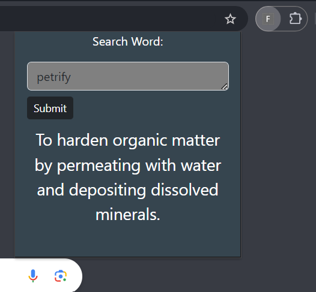

*work still in progress, new features will be getting implemented soon!*
# FreeDict: A free dictionary on the right corner!

Let's analyze a situation where you need to quickly lookup a word's meaning and you need to open a new tab, search the Google and wait for some loooooong resuts to load - isn't that tiresome?
That's why -  meet FreeDict: a free tool to find out any word's meaning in moments!

### It Uses
**Free Dictionary API** to fetch the word definitions

## Installation & Set-up
- clone this repository
- open any chromium based browser
- search `chrome://extensions/`, you'll be redirected to manage extensions page
- turn on `developer mode` *- usually found at the right top side of the page*
- click on `load unpacked` and select the folder in which you clonned this repo
- you are all set!

## Screenshots
